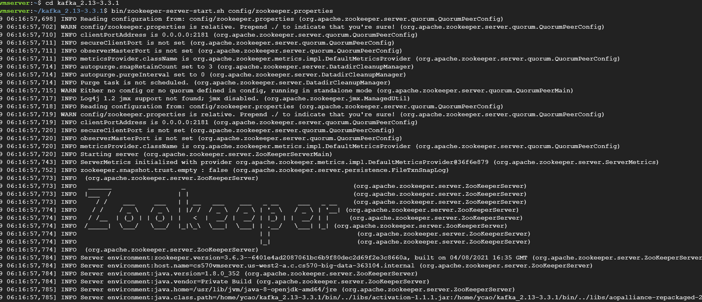
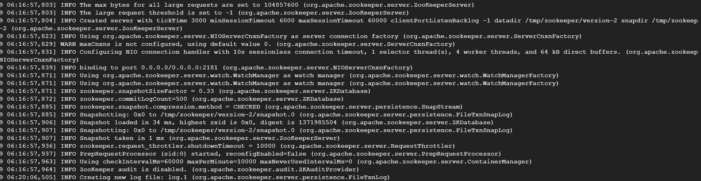
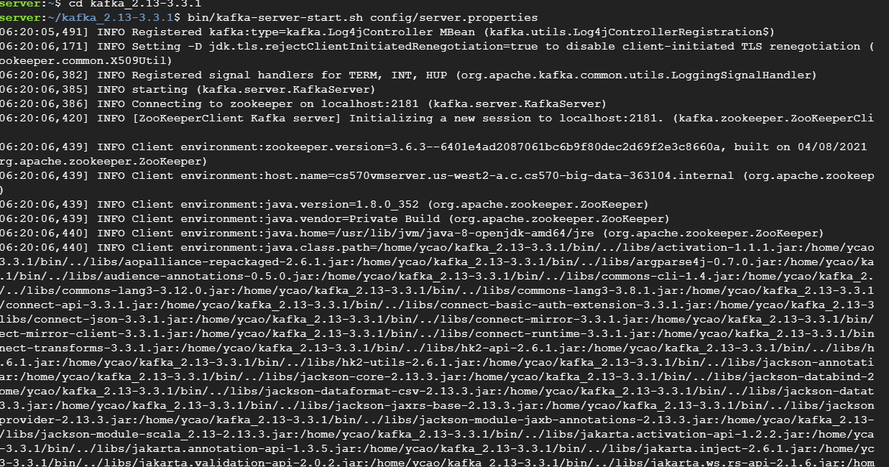

[Convert](https://https://github.com/aaren/notedown)
# **Type some code for demo**

```python
# This program prints Hello, world!

print('Hello, world!')
```

# **Add more python code**

```python
# This program adds two numbers

num1 = 1.5
num2 = 6.3

# Add two numbers
sum = num1 + num2

# Display the sum
print('The sum of {0} and {1} is {2}'.format(num1, num2, sum))
```

# **Conmmend to convert ipynb to md file**

```python
!pip install https://github.com/aaren/notedown/tarball/master
!notedown <path> --to markdown --strip > output.md
```


# Section 1: Study the basic concepts about Kafka

Three primary concerns in Real-time data ingesting are:

  How we will [consume, produce, and process] these events efficiently?

  Apache Kafka addresses the first two problems stated above. The Zookeeper
helps to maintain the server state and stores configurations as a key value pair
in ZK data tree, and use them across the cluster in a distributed manner.

  


**[Quick Start](https://kafka.apache.org/quickstart)**

### Step 1: Get Kafka

[Download](https://kafka.apache.org/downloads) the latest Kafka release and
extract it:

```
$ tar -xzf kafka_2.13-3.3.1.tgz
$ cd kafka_2.13-3.3.1
```


### Step 2: Start the Kafka Environment
*NOTE: Your local environment must have Java 8+ installed.*

##### Start the ZooKeeper service
```
$ bin/zookeeper-server-start.sh config/zookeeper.properties
```



##### Start the Kafka broker service
*Open another terminal session and run:*
```
$ bin/kafka-server-start.sh config/server.properties
```


### Step 3: Create a Topic to Store Your Events

Before you can write your first events, you must create a topic. Open another
terminal session and run:
```
$ bin/kafka-topics.sh --create --topic quickstart-events --bootstrap-server
localhost:9092
```


To list all current topics:
```
$ bin/kafka-topics.sh --list --bootstrap-server localhost:9092
```

### Step 4: Write Some Events into the Topic

Open another terminal session and run the console producer to write the events
to topic:
```
$ bin/kafka-console-producer.sh --topic quickstart-events --bootstrap-server
localhost:9092
```

You can stop the producer client with Ctrl-C at any time.

### Step 5: Read the Events
Open another terminal session and run the console consumer client to read the
events you just created:
```
$ bin/kafka-console-consumer.sh --topic quickstart-events --from-beginning
--bootstrap-server localhost:9092
```

You can stop the consumer client with Ctrl-C at any time.


# Section 2: Study the basic concepts about Spark Streaming
[Spark Streaming Guide](https://spark.apache.org/docs/latest/streaming-
programming-guide.html)

Spark Streaming provides a high-level abstraction called discretized stream
(DStream), which represents a continuous stream of data.
  DStreams can be created from input data streams from sources such as Kafka,
Flume, and Kinesis, or by applying high-level operations on other DStreams.
  Internally, a DStream is represented as a sequence of RDDs.

  

WordCount-Streaming Example

  

#### *Environment setup please refer to Section 3 - Step 1*

* First, run Netcat (a small utility found in most Unix-like systems) as a data
server
```
$ nc -lk 9999
```


* Then, in a different terminal, start the network_wordcount.py example
```
$ ./bin/spark-submit examples/src/main/python/streaming/network_wordcount.py
localhost 9999
```


# Section 3: Connecting the Dots (Python, Spark, and Kafka)
[Reference](https://towardsdatascience.com/connecting-the-dots-python-spark-and-
kafka-19e6beba6404)

### Step 1: Installing Spark

#### Download spark package
```
$ wget https://www.apache.org/dyn/closer.lua/spark/spark-3.3.1/spark-3.3.1-bin-
hadoop3.tgz
```


#### Unpack
```
$ tar -xvf spark-3.3.1-bin-hadoop3.tgz
```


#### Create soft links (optional)

This step is optional, but preferred; it facilitates upgrading spark versions in
the future.
```
$ ln -s /home/xxx/spark-2.3.2-bin-hadoop2.7/ /home/xxx/spark
```


#### Add SPARK_HOME entry to bashrc
```
$ SPARK_HOME="/home/xxx/spark"
$ export PATH=$SPARK_HOME/bin:$PATH
$ export PATH=$SPARK_HOME/sbin:$PATH
```


#### Verify the installation
```
$ pyspark
```
The following output would be visible on the console if everything were
accurate:


#### Start the master in this machine
```
$ start-master.sh
```


Spark Master Web GUI (the flowing screen) is accessible from the following URL:
http://abc.def.com:8080/


#### Starting Worker
```
$ start-slave.sh spark://abc.def.ghi.jkl:7077
```


### Step 2: Start Kafka

#### Start zookeeper: Terminal 1
```
$ bin/zookeeper-server-start.sh config/zookeeper.properties
```


#### Start Kafka: Terminal 2
```
$ bin/kafka-server-start.sh config/server.properties
```


### Step 3: Streaming

#### Create Topics and Run spark_processor.py: Terminal 3


* Code


* Result
```
$ spark-submit --jars /spark_script/spark-streaming-
kafka-0-8-assembly_2.11-2.4.8.jar --packages org.apache.spark:spark-streaming-
kafka-0-8_2.11:2.1.2 org.apache.spark:spark-sql-kafka-0-10_2.12:3.3.1  --deploy-
mode client spark_script/spark_processor.py
```


#### Start Run consumer.py: Terminal 4


#### Start Run producer.py: Terminal 5

