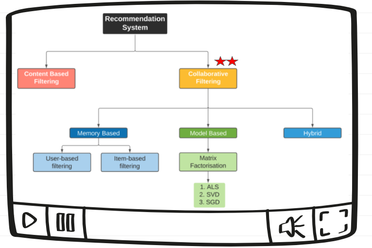
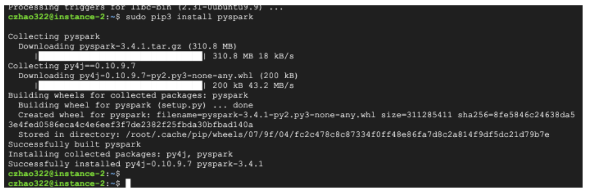
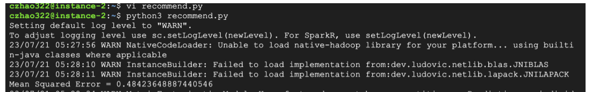

# Movie Recommendation system


**[Movie Recommendation system Google Slides](https://docs.google.com/presentation/d/1Bm1x5WRxM4nd2nwazsE5S-8ZJUpw5Di39ZobLhlzMB0/edit?usp=sharing)**


## Introduction

Recommender System is an information filtering tool that seeks to predict which product a user will like, and based on that, recommends a few products to the users. 

The two widely used approaches for building a recommender System are:

* content-based filtering (CBF)
* collaborative filtering (CF)




## Design

Recommendation using Alternating Least Squares (ALS)
The general approach is iterative. During each iteration, one of the factor matrices is held constant, while the other is solved for using least squares. 

* Modify the provided code and implement on Google Colab 
* Download the file from Google Colab and test on Google Cloud Platform

## Implementation

Create a compute engine on GCP:
Login to ssh shell:

1. Install pyspark:
```
sudo apt install python3-pip
sudo pip3 install pyspark
pyspark --version
```


2. Install java
```
java -version
sudo apt install openjdk-8-jre-headless  
sudo update-alternatives 
export JAVA_HOME=/path/to/java/installation/directory
source ~/.bashrc 
echo $JAVA_HOME
```
3. Cat u.data into this format (UserID, MovieID, rating)
```
wget https://files.grouplens.org/datasets/movielens/ml-100k/u.data

cat u.data | while read userid movieid rating timestamp
do
   echo "${userid},${movieid},${rating}"
done > formatted_u.data
```

4. Run the recommend.py
```
python3 recommend.py
```


## Enhancement

How to make the result more reliable and the training speed faster?

## Conclusion

The training time on both platforms are really long. With this project there are only less than 20,000 data in dataset. Training data will be heavier with heavier datasets. 


## References

Nair, S. (2020, August 10). PySpark Recommender System with ALS. Towards Data Science. Retrieved November 16, 2022, from https://towardsdatascience.com/build-recommendation-system-with-pyspark-using-alternating-least-squares-als-matrix-factorisation-ebe1ad2e7679 
