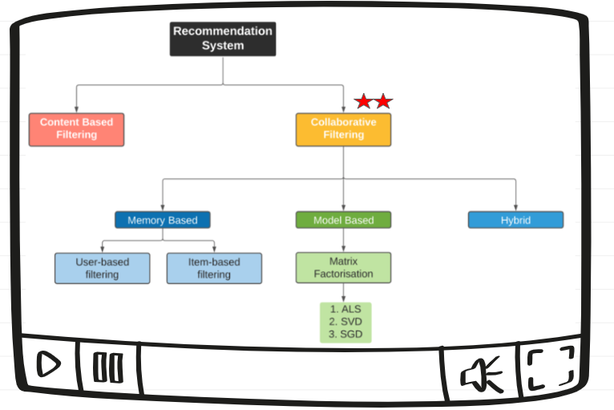

# Movie Recommendation system


**[Movie Recommendation system Google Slides](https://docs.google.com/presentation/d/1Bm1x5WRxM4nd2nwazsE5S-8ZJUpw5Di39ZobLhlzMB0/edit?usp=sharing)**


## Introduction

Recommender System is an information filtering tool that seeks to predict which product a user will like, and based on that, recommends a few products to the users. 

The two widely used approaches for building a recommender System are:

* content-based filtering (CBF)
* collaborative filtering (CF)




## Design

Recommendation using Alternating Least Squares (ALS)
The general approach is iterative. During each iteration, one of the factor matrices is held constant, while the other is solved for using least squares. 

* Modify the provided code and implement on Google Colab 
* Download the file from Google Colab and test on Google Cloud Platform

## Implementation

### Google Colab

**[Detailed steps of execute on Google Colab](https://github.com/SharonCao0920/CloudComputing/blob/main/Machine_Learning/Movie_Recommendation_System/Movie_Recommendation_System.ipynb)**

## Test

### Google Cloud Platform

* Download .py file from Colab

* Create cluster on GCP and open VM through SSH

* Upload .txt data files and .py source file to GCP


* Create directory in hdfs file system
```
$ hdfs dfs -mkdir hdfs:///data
```
   
* Modify paths in the source code 

```
$ hdfs dfs -put ./data/mllib/* hdfs:///data/mllib
```


*  Execute .py source code

```
$ spark-submit xxx.py
```

or

```
$ python xxx.py
```


## Enhancement

How to make the result more reliable and the training speed faster?

## Conclusion

The result run in Google Colab is verified in GCP with no problem. However, the training time on both platforms are really long. With this project there are only less than 20,000 data in dataset. Training data will be heavier with heavier datasets. 


## References

Nair, S. (2020, August 10). PySpark Recommender System with ALS. Towards Data Science. Retrieved November 16, 2022, from https://towardsdatascience.com/build-recommendation-system-with-pyspark-using-alternating-least-squares-als-matrix-factorisation-ebe1ad2e7679 
